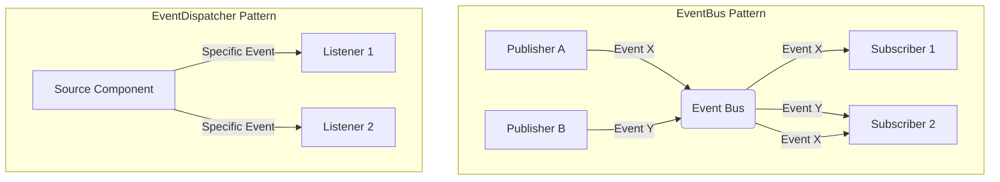

# Event Listening System Module

## Overview
This module demonstrates two distinct event handling patterns in **Java 17**:

1.  **EventBus** (The "Town Square"): Pub/Sub, Many-to-Many.
2.  **EventDispatcher** (The "Megaphone"): Observer Pattern, One-to-Many.

## Key Concepts

### 1. EventBus ("Town Square")
*   **Philosophy**: "I don't care who is listening, and I don't care who is talking."
*   **Pattern**: Publish-Subscribe (Pub/Sub).
*   **Topology**: Many-to-Many.
*   **Mechanism**: A centralized hub where publishers throw events and subscribers pick them up by type. Completely decoupled.
*   **Use Case**: Global app events (e.g., `UserLoggedInEvent`, `StockSplitEvent`) where the sender doesn't need to know the receiver.

### 2. EventDispatcher ("Megaphone")
*   **Philosophy**: "I (the specific component) am telling my specific listeners that something happened to me."
*   **Pattern**: Observer Pattern.
*   **Topology**: One-to-Many.
*   **Mechanism**: attached to a specific source object (e.g., `button.onClick`, `downloader.onProgress`). Listeners subscribe to that specific instance. Tighter coupling.
*   **Use Case**: Component-specific events where context matters (e.g., UI interactions, specific background task progress).

### Visual Comparison

## Implementation Details

### EventBus Features
-   **Generics**: `Map<Class<? extends Event>, List<EventListener<?>>>` for type-safe dispatching.
-   **Concurrency**: `ConcurrentHashMap` and `CopyOnWriteArrayList` for thread safety.
-   **Async**: Optional `ExecutorService`.

### EventDispatcher Features
-   **Generics**: `EventDispatcher<E>` is typed to the specific event it emits.
-   **Simplicity**: Uses `CopyOnWriteArrayList` for a thread-safe list of listeners.

## Implementation-Specific Interview Questions

### 1. In `EventBus`, you used `CopyOnWriteArrayList`. what is the trade-off?
**Answer**:
- **Benefit**: Lock-free traversal (fast reads/dispatch). No `ConcurrentModificationException`.
- **Cost**: Expensive writes (copy array on add/remove).
- **Relevance**: Ideal for Event systems where **reads (dispatching) >> writes (registering)**.

### 2. When would you use EventDispatcher over EventBus?
**Answer**:
- Use **EventDispatcher** when the event is tightly coupled to a specific *instance* of an object (e.g., "This specific file finished downloading").
- Use **EventBus** when the event is system-wide and the specific source doesn't matter (e.g., "Someone logged in").

### 3. How does `ExecutorService` change exception handling in EventBus?
**Answer**:
- **Sync**: Exceptions propagate and can crash the loop.
- **Async**: Exceptions are captured in `Future`. Need explicit handling (logging/UncaughtExceptionHandler) to avoid silent failures.

- **Producer Extends**: `List<? extends T>` (Read-only access to T).
- **Consumer Super**: `List<? super T>` (Write-only access to T).
- Used in our listeners to ensure type safety.

### 5. Blocking vs Non-Blocking Dispatch?
**Answer**:
- **Blocking (Synchronous)**: The caller waits for all listeners to finish. Simple, consistent, but slow listeners delay the system.
- **Non-Blocking (Asynchronous)**: The caller fires and forgets (`ExecutorService.submit()`). Fast, but error handling is harder (need `Future.get()` or callbacks).
- **Modern**: Use `CompletableFuture` to chain async actions without blocking main threads.
