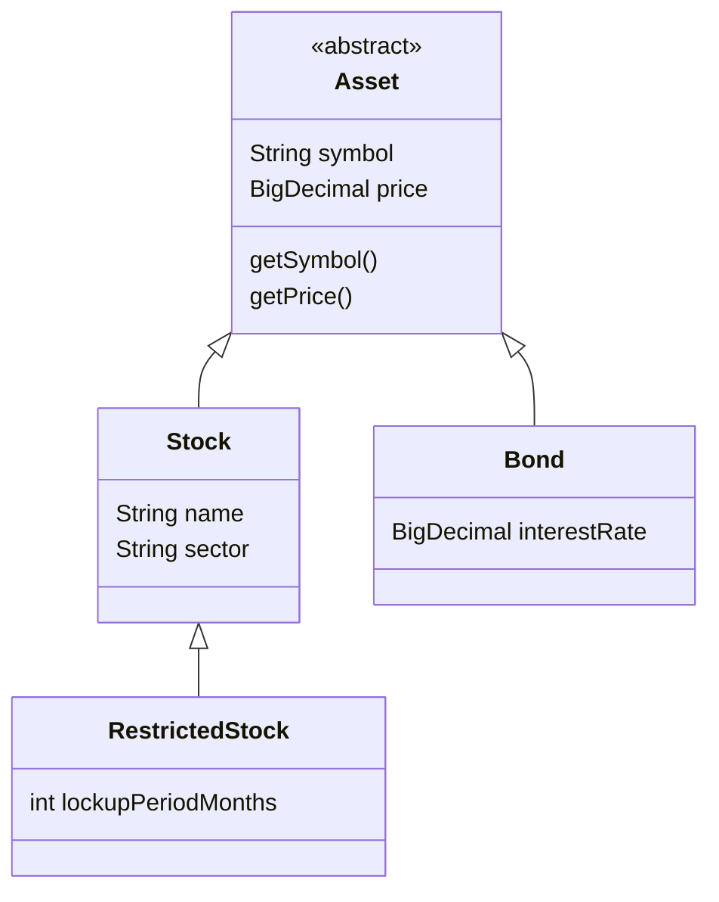

# Portfolio and Stocks Module

## Overview
This module demonstrates a clean, thread-safe implementation of a simple Portfolio management system using **Java 17**. It highlights modern Java features and solid object-oriented design principles suitable for coding interviews.

## Key Features
1.  **Inheritance & Polymorphism**: `Stock` extends `Asset`, creating a scalable hierarchy (`Asset` -> `Stock`).
2.  **Generics**: `GenericRepository<T extends Asset>` demonstrates usage of **Bounded Type Parameters** to ensure type safety.
3.  **Reflection**: `ReflectiveAssetInspector` demonstrates runtime type inspection and validation.
4.  **Thread Safety**: The `Portfolio` class uses `ConcurrentHashMap` to manage holdings, allowing safe concurrent updates.
5.  **Encapsulation**: The internal map is not exposed directly; only business methods (`addStock`, `removeStock`) are public.

## Implementation Concepts

### Inheritance Hierarchy
We introduced an `Asset` abstract class to centralize common properties like `symbol` and `price`.
The hierarchy demonstrates **Polymorphism** and **Code Reuse**:

- **Stock**: Represents standard equity.
- **Bond**: Represents debt instruments with an interest rate.
- **RestrictedStock**: A specialized `Stock` (RSU) with a lockup period. demonstrates multilevel inheritance.

### Q: Why use an Abstract Class (`Asset`) instead of an Interface?
**Refers to**: `com.interview.portfolio.Asset`
**Answer**:
- **Shared State**: Assets have common *state* (`symbol`, `price`). Interfaces (prior to Java 8) couldn't hold state. Even with default methods, they cannot hold instance fields.
- **Constructor Logic**: `Asset` enforces validation logic in its constructor (e.g., "Price cannot be negative"). An interface cannot enforce this initialization logic on implementers.
- **Identity**: 'Is-A' relationship. A Stock *is an* Asset. It's a stronger relationship than "Stock implements AssetBehavior".

### Generics (`GenericRepository<T extends Asset>`)
We use **Bounded Generics** to create a flexible yet safe repository.
- `<T>` makes it reusable for any type.
- `extends Asset` restricts usage to valid asset types only, preventing misuse (e.g., `String`).
- This avoids the pitfalls of using raw `Object` types and casting.

### Reflection (`ReflectiveAssetInspector`)
We demonstrate how to use Java Reflection to inspect class hierarchies at runtime.
- `checkSubclass(sub, super)` confirms inheritance relationships dynamically.
- This is useful for frameworks or libraries that need to validate types without knowing them at compile time.

### Q: When is Reflection appropriate?
**Refers to**: `ReflectiveAssetInspector`
**Answer**: Verification/Framework code. In business logic, explicit types are better. Reflection bypasses compile-time checks and is slower, but it allows generic tools (like serialization libraries or ORMs) to operate on unknown types.

### Java Objects (`Stock`)
`Stock` is a standard Java class (DTO) extending `Asset`. While Records are great for immutable data, full classes allow for inheritance hierarchies which typical Records do not support (Records cannot extend other classes).

### ConcurrentHashMap (`holdings`)
We use `holdings.merge()` and `holdings.compute()`. These are **atomic operations**. Even without `synchronized`, `merge` guarantees that the read-modify-write cycle (Read qty -> Add -> Write qty) happens atomically for that key.

## Implementation-Specific Interview Questions

### 1. In `Portfolio.java`, why is `getHoldings()` returning `Collections.unmodifiableMap`?
**Refers to**: `com.interview.portfolio.Portfolio.getHoldings()`
**Answer**: This is **Defensive Copying / Immutable View**.
If we returned the `ConcurrentHashMap` directly, a caller could do `portfolio.getHoldings().clear()`, wiping out the user's assets bypassing the `removeAsset` validation logic. wrapping it in `unmodifiableMap` ensures encapsulation is preserved—the outside world can *look* but cannot *touch*.

### 2. Can `Stock` be a key in a HashMap? What if `Stock` was a mutable class?
**Refers to**: `com.interview.portfolio.Stock`
**Answer**: `Stock` is designed as an **immutable class**, making it a perfect key.
If it were a mutable class, and we utilized it as a key:
1. We put `Stock("AAPL", $100)` into the map. It goes into Bucket A.
2. We change the price to `$200`. Its hashcode changes.
3. The map implementation now looks for it in Bucket B.
4. The entry is effectively lost (memory leak).
**Lesson**: Always use immutable objects for Map keys.

### 3. Explain strict encapsulation in the `Portfolio` class.
**Refers to**: `com.interview.portfolio.Portfolio`
**Answer**: The `Portfolio` class follows the "Tell, Don't Ask" principle. We don't ask for the map and manipulate it. We tell the portfolio to `addAsset`.
This allows `Portfolio` to enforce **Invariants**: "Quantity must be positive", "Cannot sell more than you own". If we exposed the raw list/map, we couldn't guarantee these rules are followed.

### 4. How does `Stream` API in repository compare to a `for` loop?
**Refers to**: `com.interview.portfolio.PortfolioService` / Repository
**Answer**:
- **Declarative**: Streams say *what* we want (`filter(sector).collect()`) rather than *how* (indexes, temporary lists).
- **Parallizable**: We can easily switch to `parallelStream()` if the dataset is huge (though not always faster).
- **Readability**: For complex filtering/mapping chains, Streams are often more readable than nested loops.

---

## Broader Conceptual Interview Questions (Collections & Streams)

### 5. How does a HashMap handle collisions internally?
**Concept**: Algorithms & Data Structures.
**Answer**:
- **Chaining**: When multiple keys have the same hash (Collision), they are stored in a linked list (chain) at that bucket index.
- **Treeification (Java 8+)**: If a chain grows too long (threshold is 8), Java converts the Linked List into a **Red-Black Tree**. This improves lookup performance from O(n) (list scan) to O(log n) (tree search), preventing Denial-of-Service attacks based on hash collisions.

### 6. Difference between `map()` and `flatMap()` in Streams?
**Concept**: Functional Programming.
**Answer**:
- **`map`**: Transforms each element one-to-one.
    - `Stream<String> -> map(s -> s.length()) -> Stream<Integer>`
- **`flatMap`**: Transforms each element one-to-many. It "flattens" the resulting streams into a single stream.
    - Example: You have a `List<Order>`. Each `Order` has `List<LineItem>`.
    - `orders.stream().flatMap(order -> order.getLineItems().stream())` gives you a single `Stream<LineItem>`.

### 7. Checked vs Unchecked Exceptions?
**Concept**: Error Handling.
**Answer**:
- **Checked (extends `Exception`)**: Compiler forces you to `catch` or `throws`. Represents recoverable error conditions (e.g., `IOException` file not found).
- **Unchecked (extends `RuntimeException`)**: Compiler does not force handling. Represents programming errors (e.g., `NullPointerException`, `IndexOutOfBounds`).
- **Trend**: Modern framworks (Spring) and libraries favour Unchecked exceptions to reduce boilerplate and "catch-ignore" blocks.

### 8. What is the contract between `equals()` and `hashCode()`?
**Refers to**: Essential for `Stock` to work as a Map key.
**Answer**:
1. If `x.equals(y)` is true, `x.hashCode()` MUST equal `y.hashCode()`.
2. If `hashCode()` is different, objects are definitely not equal.
3. If `hashCode()` is same, objects MIGHT be equal (collision).
**Violation**: If you override equals but not hashCode, storing objects in a HashMap will break (you'll lose items).

### 9. Why should you avoid `Optional` in fields?
**Concept**: Java 8 Best Practices.
**Answer**:
- **Serializable**: `Optional` does not implement `Serializable`. If your class needs to be serialized (e.g., for caching/sending over network), `Optional` fields will fail.
- **Memory**: It adds logical overhead (wrapping object).
- **Best Practice**: Use `Optional` only as a **return type** for methods to indicate "no result", forcing the caller to handle nullability.
