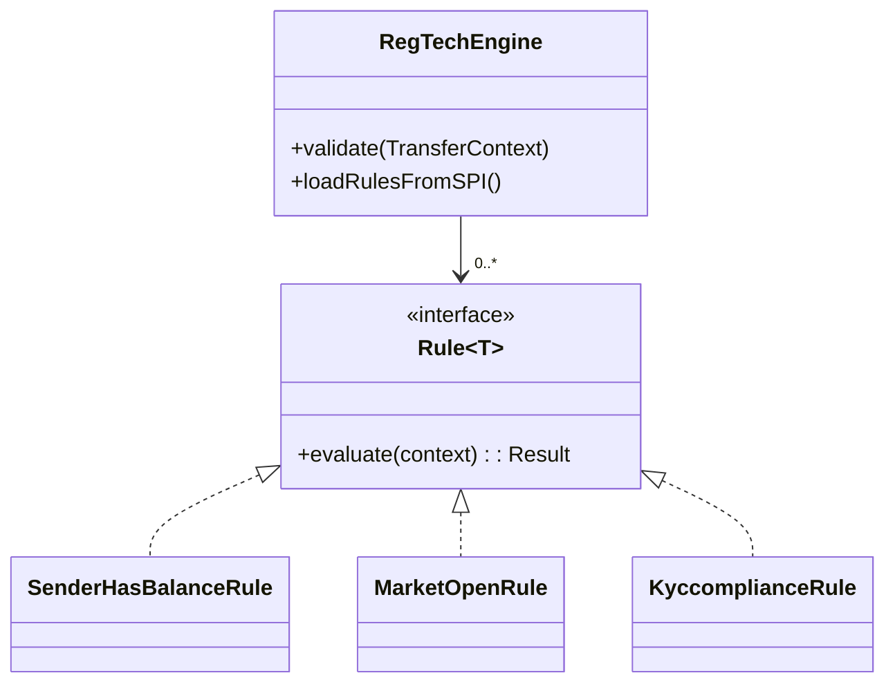

# RegTech (Validation Rules) Module

## Overview
This module implements a flexible **Rules Engine** for validating Share Transfers, written in **Java 17**. It ensures compliance with business rules (KYC, Balance, Market Status) before any transaction is processed.

## Features
- **Java SPI (Plugin Architecture)**: Uses `ServiceLoader` to automatically discover and load new Rules from the classpath (`META-INF/services`).
- **Extensible Rules Engine**: Uses the **Strategy Pattern** to allow adding new rules without modifying the engine.
- **Fail-Fast Validation**: Stops at the first failed rule to report errors immediately.
- **Clean Architecture**: Decoupled dependencies using interfaces (`PortfolioRepository`, `MarketProvider`).

## Implementation Details
- **`Rule<T>` Interface**: The core abstraction (Strategy) for any validation logic.
- **`RegTechEngine`**: Context class that manages and executes the strategies.
- **`TransferContext`**: A **Java Record** holding immutable context (Sender, Receiver, Stock, Quantity).
- **Fail-Fast vs Fail-Safe**: The engine implements fail-fast logic (returns on first error). This is efficient for blocking transactions but can be switched to "collect all errors" if needed for UI feedback.

### Visual Architecture

## Implementation-Specific Interview Questions

### 1. What is Java SPI (`ServiceLoader`) and why use it?
**Refers to**: `RegTechEngine.loadRulesFromSPI()`
**Answer**:
- **Concept**: Service Provider Interface. It's a standard Java mechanism to load implementations of an interface found in `META-INF/services` on the classpath.
- **Benefit**: **Plug-and-Play Extensibility**. You can ship a generic "Engine" JAR. Another team can build a separate "Rules" JAR. When both are on the classpath, the Engine automatically finds and uses the new Rules *without recompiling* the Engine.
- **Real World**: JDBC Drivers (`java.sql.Driver`), Logging (SLF4J bindings).

### 2. Why use a Rules Engine (Strategy Pattern) instead of a simple `switch` or `if-else` block?
**Refers to**: `com.interview.regtech.RegTechEngine`
**Answer**: A giant `if-else` block violates the **Single Responsibility Principle** (the service knows too much) and the **Open/Closed Principle** (you must modify the service to add a rule).
In this example, `RegTechEngine` doesn't know *what* the rules are, only *how to run them*. Each Rule is a separate class (`SenderHasBalanceRule`), making them easier to test in isolation, reuse in other contexts, and maintain by different teams.

### 3. How did you ensure thread safety in the Engine?
**Refers to**: `com.interview.regtech.Rule` implementations
**Answer**: The `RegTechEngine` is stateless regarding the *data* (it just passes `TransferContext` through).
Thread safety depends on the Rules.
- `SenderHasBalanceRule` delegates to `PortfolioRepository`. If that repository uses safe structures (like `ConcurrentHashMap` in the Portfolio module), the rule is safe.
- `TransferContext` is a **Record**, so it is immutable. Immutable objects can be safely shared between multiple threads without synchronization, preventing race conditions on the input data.

### 4. How would you handle rules that depend on each other (e.g., Rule B runs only if Rule A passes)?
**Refers to**: `com.interview.regtech.RegTechEngine` structure
**Answer**: The current design is a linear chain. For dependencies, we could:
1.  **Composite Pattern**: Create a `CompositeRule` that internally holds Rule A and Rule B and manages their execution order.
2.  **Order Property**: Add `getOrder()` to the `Rule` interface and sort the list in the Engine before execution.
3.  **Stateful Context**: Enrich `TransferContext` with results from previous rules (though this reduces purity).

### 5. What is the benefit of `TransferContext` being a Record?
**Refers to**: `com.interview.regtech.TransferContext`
- **Immutability**: A rule cannot accidentally change the `quantity` and affect subsequent rules.
- **Readability**: The intent "this is just data" is clear.

### 6. Fail-Fast vs Error Accumulation?
**Refers to**: `RegTechEngine` logic
**Answer**:
- **Fail-Fast**: Return immediately on first error.
    - *Pro*: Efficient (saves CPU), prevents cascading errors.
    - *Con*: User fixes one error, submits, gets another error.
- **Accumulation (validation)**: Run ALL rules, collect ALL errors.
    - *Pro*: Better UX (fix everything at once).
    - *Con*: Wasted CPU on invalid requests.
- **Hybrid**: Fail-fast on critical checks (Security/Auth), accumulate on data format errors.

---

## Broader Conceptual Interview Questions (Design Patterns)

### 7. Strategy Pattern vs State Pattern - What is the difference?
**Concept**: OO Design Patterns.
**Answer**: Both share the same class structure (Context delegates to an Interface), but the *intent* differs.
- **Strategy Pattern** (Used here): The client *chooses* the algorithm (Rule) to be used. Implementation doesn't usually change during the object's life.
- **State Pattern**: The object *changes* its internal strategy automatically as its state changes (e.g., A TCP Connection switching from `Listening` to `Connected` state). The transition logic is often embedded within the states themselves.

### 8. What is Dependency Injection (DI) and why is it useful?
**Concept**: SOLID (Dependency Inversion).
**Answer**: DI is a technique where an object receives other objects that it depends on (dependencies), rather than creating them itself.
- **Example**: `SenderHasBalanceRule` does NOT do `new PortfolioRepository()`. It receives it in the constructor.
- **Benefit**:
    - **Decoupling**: Classes don't need to know how to construct their dependencies.
    - **Testability**: We can inject a **Mock** repository during testing (as seen in `SenderHasBalanceRuleTest`) to simulate different scenarios without needing a real database.

### 9. Explain the Liskov Substitution Principle (LSP).
**Concept**: SOLID.
**Answer**: LSP states that objects of a superclass should be replaceable with objects of its subclasses without breaking the application.
- **In practice**: If `Rule<T>` throws a `RuntimeException` while other rules return `RuleResult.failure()`, it violates LSP because the Engine expects a result, not a crash. All implementations of an interface must adhere to the contract defined by that interface.

### 10. Java Functional Interfaces in simple terms.
**Refers to**: `Rule<T>`.
**Answer**:
- **Predicate<T>**: Takes T, returns boolean (`stream.filter`).
- **Function<T, R>**: Takes T, returns R (`stream.map`).
- **Consumer<T>**: Takes T, returns void (`stream.forEach`).
- **Supplier<T>**: Takes nothing, returns T (`Optional.orElseGet`).
